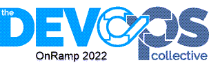

# OnRamp 2022

The repository contains class material for the OnRamp 2022 program which is part of the [PowerShell+DevOps Global Summit](https://powershell.org/calendar/powershell-devops-global-summit-2022/). All items are offered as educational material. Nothing in this repository should be construed as material to use in a production environment.

The video recordings are too large to directly store in Github. They are stored in the Sharepoint site for PwoerShell.org. You will find a `README` file in the relevant directories with a link to the vide. You can watch online in your browser or download.
